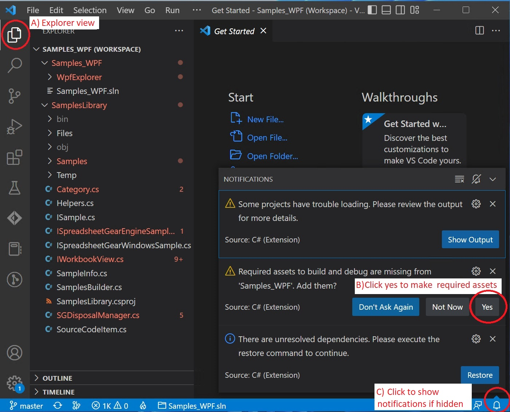
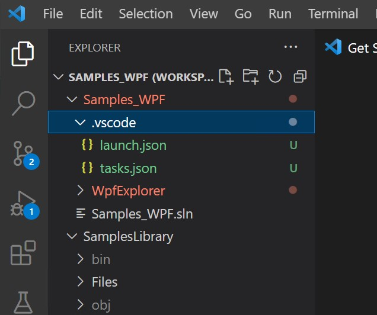
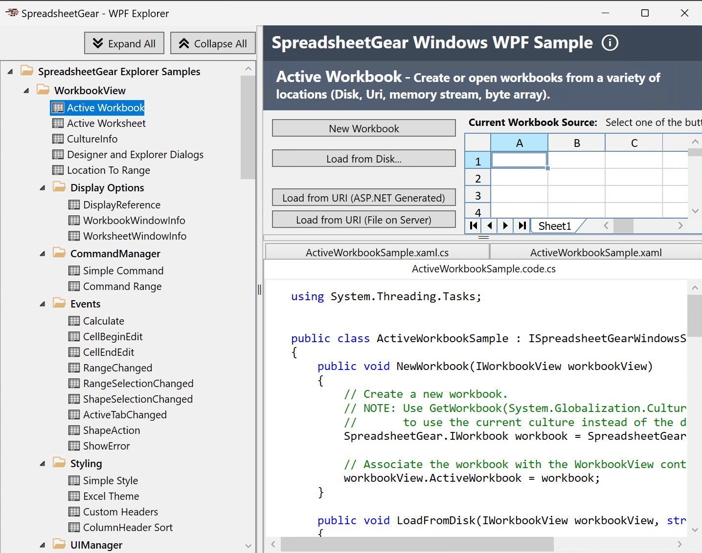

## Open and run Samples_WPF in Visual Studio Code
1. Run Visual Studio Code and select "File | Open workspace from File...".
2. Navigate to your local **SpreadsheetGearCodeSamples_VSCode folder** and open **Samples_WPF.code-workspace**
3. You should see Samples_WPF.code-workspace open in VSCode:

3. Show the VSCode Explorer by clicking its icon in the upper left (***A in the above image***)
4. You should see "Notifications" popups in the lower right. If you don't see them click the Notifications bell icon (***C in the above image***)
5. **Adding "Required assets" is the only notification you need to take action on. Click "Yes" *(B in the above image)***
6. You should see VSCode Explorer updated with a new ".vscode" folder and files launch.json and tasks.json:
 

7. **Run the WPF_Samples application by pressing F5 or using the VSCode menu "Run | Start Debugging"**
8. You should see the WPF_Samples "WPF Explorer" application:

