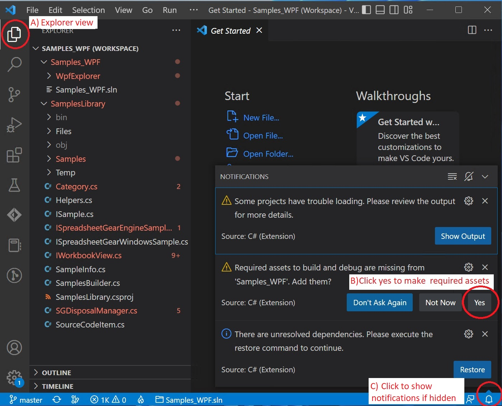

## Open and run Samples_WPF in Visual Studio Code
1. Run Visual Studio Code and select "File | Open workspace from File...".
2. Navigate to your local **SpreadsheetGearCodeSamples_VSCode folder** and select **Samples_WPF.code-workspace** to open it.

 
  *After opening Samples_WPF.code-workspace in Visual Studio Code*
  
  3. more text here
