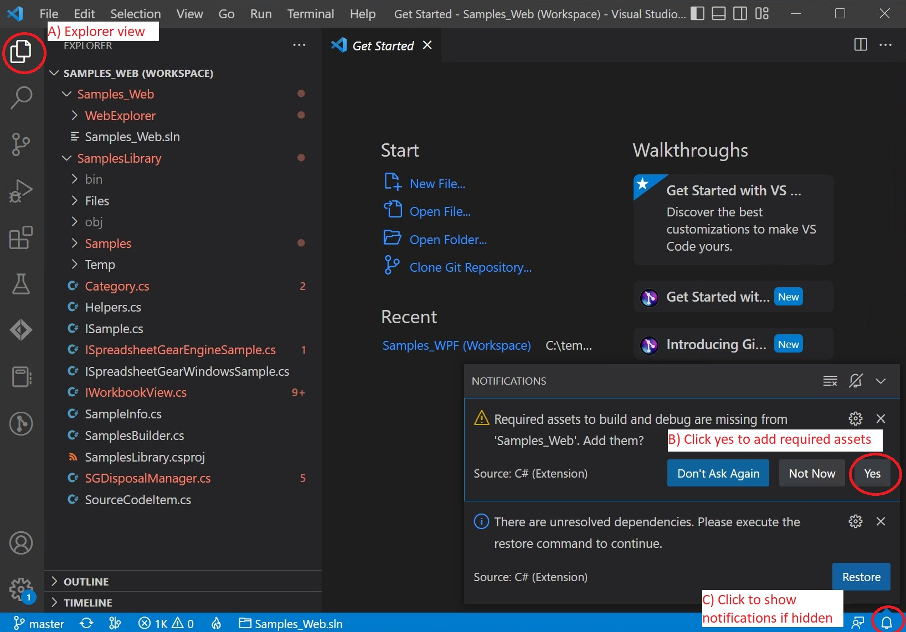
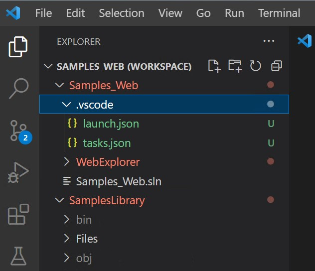
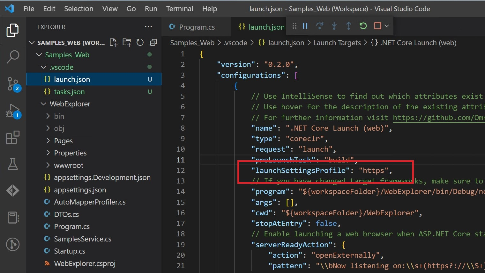
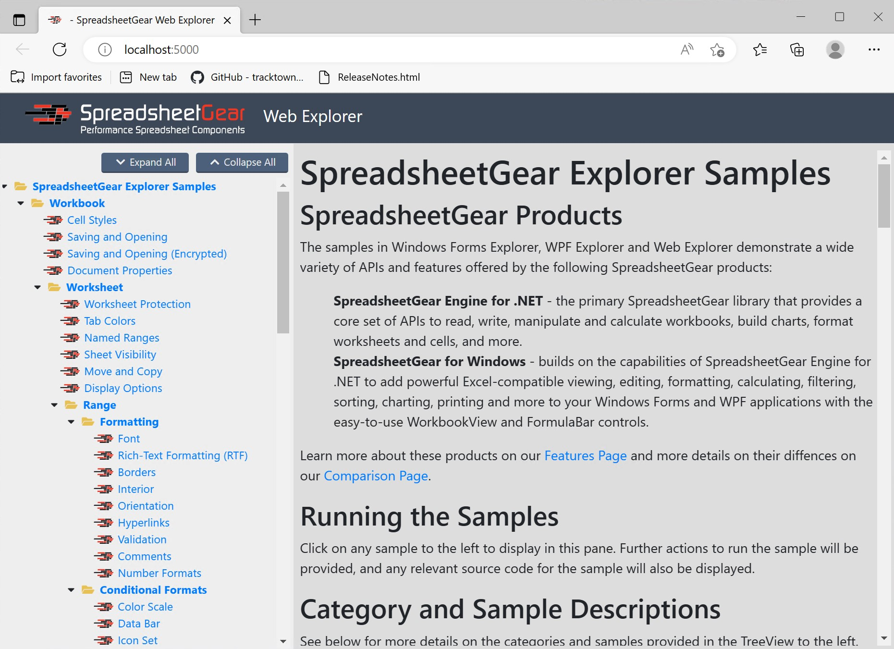

## Open and run Samples_Web in Visual Studio Code
1. Run Visual Studio Code and select "File | Open workspace from File...".
2. Navigate to your local **SpreadsheetGearCodeSamples_VSCode folder** and open **Samples_Web.code-workspace**
3. You should see Samples_Web.code-workspace open in Visual Studio Code (VSCode):



3. Show the VSCode Explorer by clicking its icon in the upper left (***A in the above image***)
4. You should see "Notifications" pop-ups in the lower right. If you don't see them click the Notifications bell icon (***C in the above image***)
5. **Adding "Required assets" is the only notification you need to take action on. Click "Yes" *(B in the above image)***
6. You should see VSCode Explorer updated with a new ".vscode" folder and files launch.json and tasks.json:
 


7. **Run the Samples_Web application by pressing F5 or using the VSCode menu "Run | Start Debugging"**
8. You will see the Samples_Web "Web Explorer" application, but note that it uses http protocol. To use https protocol add this line to your launch.json file in the .vscode folder:
```
"launchSettingsProfile": "https",
```


9. Here is the Samples_Web "Web Explorer" application using https.



10. Any remaining Notifications warnings should go away if you close Visual Studio Code and then start it again and re-open Samples_Web.code-workspace.


