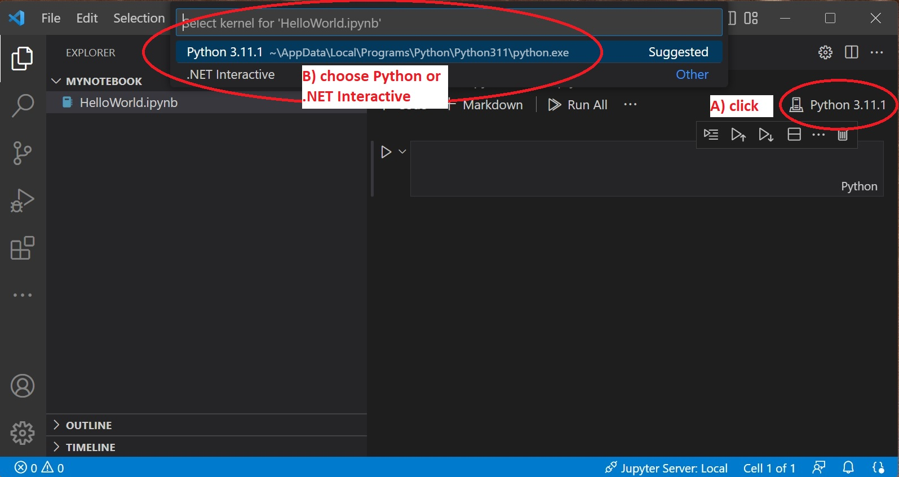

# Get Started #
1. [SpreadsheetGear Nuget packages used in these demos](../README.md#get-started)
2. [Install Visual Studio Code and Python on Windows, Linux or MacOS](../README.md#visual-studio-code-installation)
3. Use Git to clone this repository

# Python Jupyter Notebooks in Samples_JupyterCSharp #
- [JupyterPython_HelloWorld.ipynb](../Samples_JupyterPython/JupyterPython_HelloWorld.ipynb) - a simple example showing SpreadsheetGear in Python
- [PythonExcelToolsComparison.ipynb](../Samples_JupyterPython/PythonExcelToolsComparison.ipynb) - a Python Excel tools performance comparison 

*Note: Viewing the above Jupyter notebooks on GitHub will present a static HTML view. To use them interactively you need to open them in a Jupyter notebook editor like Visual Studio Code.*

# Open Samples_JupyterPython notebooks interactively in VSCode #
1. Run Visual Studio Code and select "File | Open workspace from File...".
2. Navigate to your local **SpreadsheetGearCodeSamples_VSCode folder** and open **Samples_JupyterPython.code-workspace**
3. You should see Samples_JupyterPython.code-workspace open in Visual Studio Code (VS Code).
4. Show the VSCode Explorer by clicking its icon in the upper left.
5. Use VSCode explorer to double-click and open the Jupyter notebook you want to see.

# Pythonnet makes it possible to use the .NET6 SpreadsheetGear engine in Python code #

[Python.NET is a package](https://pypi.org/project/pythonnet/) that gives Python programmers nearly seamless integration with the .NET Common Language Runtime (CLR) and provides a powerful application scripting tool for .NET developers. It allows Python code to interact with the CLR, and may also be used to embed Python into a .NET application.

A minor inconvenience: Python doesn't support Nuget package references which is how [.NET6 SpreadsheetGear](https://www.nuget.org/packages/SpreadsheetGear/9.1.19-beta) is distributed. In this repo see [sample code using SpreadsheetGear in Python](../Samples_JupyterPython/JupyterPython_HelloWorld.ipynb) showing a simple workaround. Perhaps a future [python package](https://www.nuget.org/packages) will be made available to install the .NET6 SpreadsheetGear assembly into the active Python environment.

From Python.NET documentation: [Embedding .NET into Python](https://pythonnet.github.io/pythonnet/python.html)

# What are Jupyter Notebooks? #

A Jupyter Notebook is a document for creating and sharing live code, equations, visualizations, and text.

The history of Jupyter Notebooks in Visual Studio Code:
- Visual Studio Code has long supported Python Jupyter Notebooks and Python code.
- In 2019 Microsoft introduced an additional Jupyter kernel, now called .NET Interactive kernel, that supports C#, F#, Powershell, Javascript, SQL, KQL, HTML and Mermaid.

# Make your Jupyter notebook Python or .NET Interactive (C#) #
1. In VSCode add a new file with the ".ipynb" extension 
2. Open the notebook in VSCode
3. The active Jupyter notebook kernel will show in the upper right (A in the image below). Click on it if you want to change the kernel.
4. After clicking the active kernel you should see other kernel options (B in the image below). If you want a Python notebook then select Python as the kernel.

## Useful links ##
- [Jupyter Notebooks in VS Code](https://code.visualstudio.com/docs/datascience/jupyter-notebooks)
- [pythonnet on pipy.org](https://pypi.org/project/pythonnet/)
- [Python.NET documentation](https://pythonnet.github.io/pythonnet/index.html)

